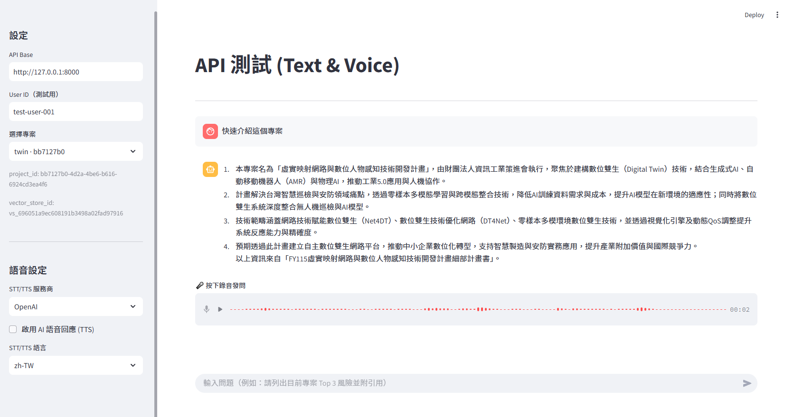

# 支援語音互動的 RAG AI 助理 (RAG AI Assistant with Voice Interaction)

這是一個 RAG (檢索增強生成) AI 助理專案，支援上傳 PDF 文件以建立知識庫。本專案提供 Streamlit 使用者介面，並支援文字與語音 (STT/TTS) 互動功能。



## 功能特色

-   **RAG 核心**：上傳 PDF 文件以建立知識庫（使用 OpenAI Vector Stores）。
-   **對話介面**：根據上傳的文件內容進行問答。
-   **語音互動**：
    -   **語音轉文字 (STT)**：使用麥克風直接提問。
    -   **文字轉語音 (TTS)**：聆聽 AI 的語音回覆。
    -   **多服務商支援**：可切換使用 **Google Cloud** 或 **OpenAI** 的語音服務。

## 前置需求

1.  **Python 3.8+**
2.  **OpenAI API Key**：請在 `.env` 中設定 `OPENAI_API_KEY`。
3.  **Google Cloud 服務帳號（選用）**：
    -   若要使用 Google STT/TTS 則為必須。
    -   請將您的 `gcp-sa.json` 金鑰檔放在此專案目錄下。
    -   請至 Google Cloud Console 啟用 "Cloud Speech-to-Text API" 與 "Cloud Text-to-Speech API"。

## 安裝說明

1.  安裝相依套件：
    ```bash
    pip install -r requirements.txt
    ```

2.  建立 `.env` 檔案：
    ```env
    OPENAI_API_KEY=sk-proj-...
    API_BASE=http://127.0.0.1:8000
    RAG_DB_PATH=rag_admin.db
    # 若目錄下存在 gcp-sa.json，程式會自動設定 GOOGLE_APPLICATION_CREDENTIALS
    ```

## 使用說明

本專案包含兩個主要的前端介面與一個後端 API。

### 1. 啟動後端 API
後端負責處理 RAG 邏輯與資料庫連線。
開啟終端機並執行：
```powershell
uvicorn api_server:app --reload
```
*預設連接埠為 8000。*

### 2. 資料管理後台 (app.py)
這是用來管理知識庫的介面。
開啟終端機並執行：
```powershell
streamlit run app.py
```
**功能特色**：
-   **專案管理**：建立、改名或封存專案。
-   **與 OpenAI 同步**：自動建立 OpenAI Vector Store。
-   **文件上傳**：上傳 PDF 文件，系統會自動加入 OpenAI 索引。
-   **檔案管理**：檢視目前專案內的檔案，或將其移除。

### 3. 對話聊天前台 (ui_streamlit.py)
這是給終端使用者問問題的介面。
開啟 **另一個** 終端機並執行：
```powershell
streamlit run ui_streamlit.py
```
**功能特色**：
-   **對話**：輸入問題，AI 會根據 `app.py` 上傳的文件回答。
-   **專案選擇**：在側邊欄選擇要針對哪個專案進行問答。
-   **語音互動**：支援用說的問問題，並用語音聽回答。
-   **多服務商支援**：
    -   可選擇 **Google** 或 **OpenAI** 作為語音引擎。
    -   設定位於側邊欄 "語音設定"。

## 疑難排解 (Troubleshooting)

-   **API Error 404**：確認 `api_server.py` 是否已在 port 8000 執行中。
-   **Google STT/TTS 無法使用**：檢查 `gcp-sa.json` 是否存在，且已啟用相關 Google Cloud API。
-   **麥克風無法使用**：檢查瀏覽器的麥克風權限設定。
